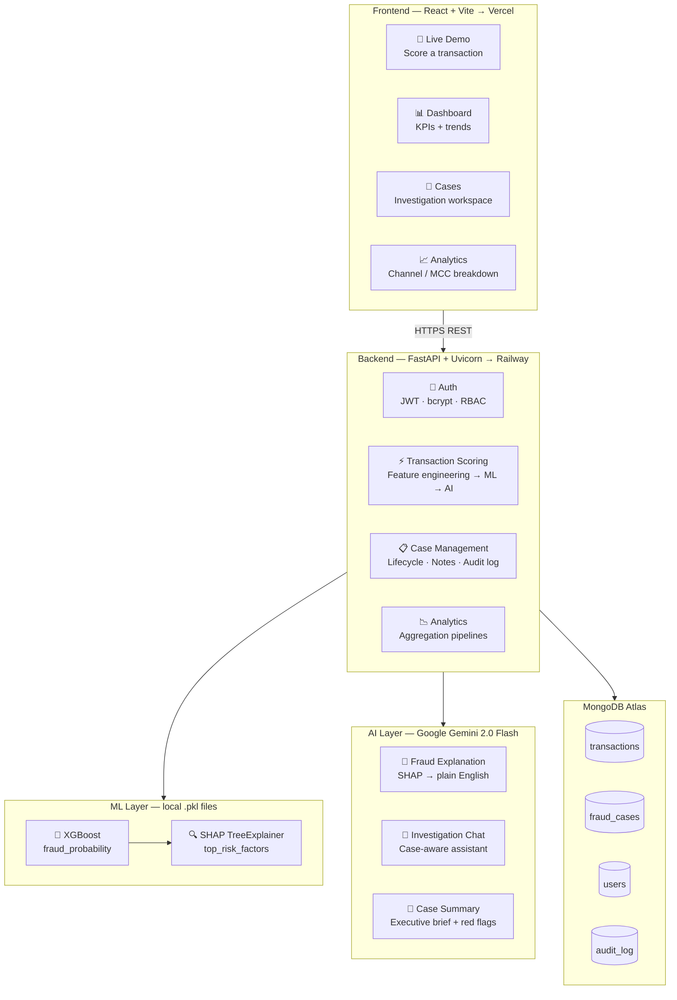
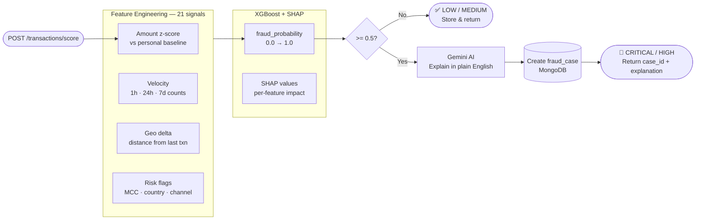

# Card Fraud Intelligence

A production-grade card transaction fraud detection and investigation system combining **XGBoost + SHAP** for real-time ML scoring with **Google Gemini AI** for analyst-facing explanations and conversational case investigation.

Built to demonstrate end-to-end banking AI/ML engineering — from raw IEEE-CIS transaction data to a deployable REST API with a full fraud investigation workflow.

---

## Architecture



---

## Transaction Scoring Flow



---

## Features

### ML Layer (XGBoost + SHAP)
- Real-time fraud scoring on 21 engineered behavioral features
- **Velocity**: transaction count at 1h / 24h / 7d windows — high velocity is a primary fraud signal
- **Amount z-score**: how far this transaction deviates from the cardholder's personal spending baseline
- **Geo delta**: haversine distance from last transaction; flags impossible travel (>900 km/h)
- **Risk signals**: high-risk MCC codes (Crypto/Wire, Gambling, Money Transfer), new merchant, international flag
- **SHAP explainability**: every prediction returns top risk factors with directional impact scores

### AI Layer (Google Gemini 2.0 Flash)
- **Fraud Explanation**: translates SHAP values into plain-English analyst-ready summaries
- **Investigation Chat**: conversational assistant with full case context and banking procedure awareness
- **Case Summary**: AI-generated executive brief with red flags list and recommended action
- **Graceful fallback**: template-based explanation if Gemini is unavailable — API never fails

### API (FastAPI)
- JWT authentication with role-based access: `analyst` / `senior_analyst` / `manager`
- Full fraud case lifecycle: `OPEN → UNDER_INVESTIGATION → CONFIRMED_FRAUD / FALSE_POSITIVE → CLOSED`
- Investigation notes, case assignment, immutable audit trail
- Analytics endpoints: dashboard KPIs, daily trends, fraud by channel and MCC

---

## ML Model Performance

Trained on the [IEEE-CIS Fraud Detection](https://www.kaggle.com/c/ieee-fraud-detection) dataset — 590,540 real transactions at 3.5% fraud rate.

| Metric | 5-Fold CV | Final (full train) |
|--------|-----------|-------------------|
| AUC-ROC | **0.9512 ± 0.0009** | 0.9777 |
| Average Precision | **0.7126 ± 0.0043** | 0.7955 |
| Recall @ 0.5 | 90.7% | — |
| Specificity @ 0.5 | 94.8% | — |

Low CV variance (±0.0009 AUC across 5 folds) indicates the model generalises consistently rather than overfitting any single split.

Training notebook: [`notebooks/train_on_colab.ipynb`](notebooks/train_on_colab.ipynb) — runs on a free Colab T4 GPU in ~30 minutes.

---

## Quickstart

### 1. Clone and install
```bash
git clone https://github.com/kohliamitoj/card-fraud-intelligence
cd card-fraud-intelligence
python -m venv .venv && source .venv/bin/activate
pip install -r requirements.txt
```

### 2. Configure environment
```bash
cp .env.example .env
# Edit .env — set MONGODB_URI and GEMINI_API_KEY
```

### 3. Train the model (synthetic data, no Kaggle account needed)
```bash
python -m training.generate_synthetic_data   # generates 50,000 transactions
python -m training.train                     # XGBoost 5-fold CV + SHAP
python -m training.evaluate                  # ROC / PR / SHAP plots
```

Or train on the real IEEE-CIS dataset via the Colab notebook for production-grade performance.

### 4. Start the API
```bash
uvicorn app.main:app --reload --host 0.0.0.0 --port 8000
```

Open [http://localhost:8000/docs](http://localhost:8000/docs) for the interactive Swagger UI.

---

## Score a Transaction (Example)

```bash
curl -X POST http://localhost:8000/api/v1/transactions/score \
  -H "Authorization: Bearer <token>" \
  -H "Content-Type: application/json" \
  -d '{
    "transaction_id": "TXN-001",
    "cardholder_id": "CH-0042",
    "card_last4": "7823",
    "card_type": "VISA",
    "amount": 45000.00,
    "currency": "USD",
    "merchant_id": "M-9912",
    "merchant_name": "CryptoXchange Global",
    "merchant_category_code": "6051",
    "channel": "ONLINE",
    "location_city": "Lagos",
    "location_country": "NG",
    "timestamp": "2025-06-29T02:34:00Z"
  }'
```

**Response:**
```json
{
  "transaction_id": "TXN-001",
  "fraud_probability": 0.9312,
  "is_flagged": true,
  "risk_level": "CRITICAL",
  "fraud_explanation": "This transaction is highly suspicious: a $45,000 transfer to a crypto exchange in Nigeria at 2 AM is far outside this cardholder's typical spend pattern, and the merchant category carries the highest fraud risk in our portfolio.",
  "top_risk_factors": [
    {"feature": "is_high_risk_country", "impact": 0.24, "direction": "increases_risk"},
    {"feature": "is_high_risk_mcc",     "impact": 0.21, "direction": "increases_risk"},
    {"feature": "amount_zscore",         "impact": 0.18, "direction": "increases_risk"},
    {"feature": "is_night",             "impact": 0.12, "direction": "increases_risk"}
  ],
  "case_id": "a1b2c3d4-..."
}
```

---

## API Reference

### Auth
| Method | Endpoint | Description |
|--------|----------|-------------|
| POST | `/api/v1/auth/register` | Register analyst account |
| POST | `/api/v1/auth/login` | Get JWT token |
| GET | `/api/v1/auth/me` | Current user profile |

### Transactions
| Method | Endpoint | Description |
|--------|----------|-------------|
| POST | `/api/v1/transactions/score` | Score a transaction in real time |
| GET | `/api/v1/transactions/{id}` | Transaction detail |
| GET | `/api/v1/transactions/` | List transactions |

### Fraud Cases
| Method | Endpoint | Description |
|--------|----------|-------------|
| GET | `/api/v1/cases/` | List cases (filter by status / risk) |
| GET | `/api/v1/cases/{id}` | Full case with explanation + SHAP |
| PATCH | `/api/v1/cases/{id}/status` | Update case status |
| POST | `/api/v1/cases/{id}/notes` | Add investigation note |
| PATCH | `/api/v1/cases/{id}/assign` | Assign to analyst |

### Investigation (AI)
| Method | Endpoint | Description |
|--------|----------|-------------|
| POST | `/api/v1/investigation/chat` | Chat with AI about a case |
| GET | `/api/v1/investigation/cases/{id}/summary` | AI executive summary |

### Analytics
| Method | Endpoint | Description |
|--------|----------|-------------|
| GET | `/api/v1/analytics/dashboard` | KPI dashboard |
| GET | `/api/v1/analytics/trends` | Daily fraud trends |
| GET | `/api/v1/analytics/by-merchant-category` | Fraud by MCC |
| GET | `/api/v1/analytics/by-channel` | Fraud by channel |

---

## Tech Stack

| Layer | Technology |
|-------|-----------|
| API Framework | FastAPI + Uvicorn |
| ML Model | XGBoost 3.x |
| Explainability | SHAP (TreeExplainer) |
| Class Imbalance | scale_pos_weight + SMOTE |
| AI / LLM | Google Gemini 2.0 Flash |
| Database | MongoDB Atlas (async via Motor) |
| Authentication | JWT (python-jose + passlib bcrypt) |
| Frontend | React 18 + Vite + Tailwind CSS |
| Deployment | Railway (API) + Vercel (Frontend) |

---

## Domain Context

This system mirrors real-world card fraud operations at card-issuing banks:

- **MCC risk profiling**: codes 7995 (Gambling), 6051 (Crypto/Wire), 4829 (Money Transfer) carry the highest fraud risk — reflected in feature engineering and SHAP outputs
- **Velocity signals**: high transaction count in short time windows is an industry-standard primary fraud indicator
- **Impossible travel**: flags cases where a card was used in two locations too far apart to travel between in the elapsed time
- **SAR threshold**: Suspicious Activity Reports to FinCEN are referenced at the $10,000 threshold in AI investigation suggestions
- **Case lifecycle**: mirrors the actual fraud ops workflow at card-issuing banks — open, investigate, confirm or dismiss

---

## Project Structure

```
card-fraud-intelligence/
├── app/
│   ├── api/v1/endpoints/     # FastAPI route handlers
│   ├── core/                 # ML scoring, SHAP, Gemini AI
│   ├── db/                   # MongoDB async connection
│   ├── schemas/              # Pydantic request/response models
│   └── services/             # Business logic
├── config/                   # Environment settings (pydantic-settings)
├── training/                 # Data generation, feature engineering, training
├── notebooks/                # Colab training notebook
├── models/                   # Trained .pkl files (gitignored)
├── data/                     # Raw data (gitignored)
├── frontend/                 # React app
│   └── src/
│       ├── pages/            # Demo, Dashboard, Cases, Analytics
│       └── components/       # FraudMeter, ShapChart, badges
├── Dockerfile
└── requirements.txt
```
